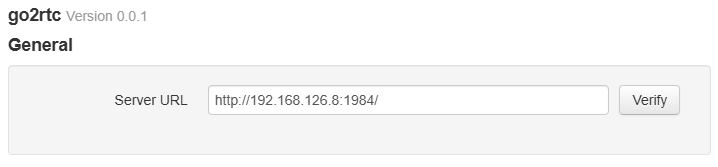
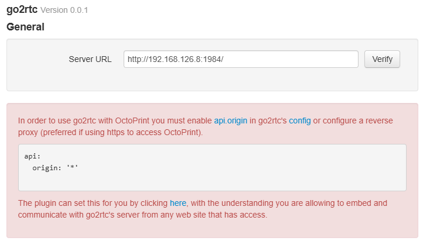
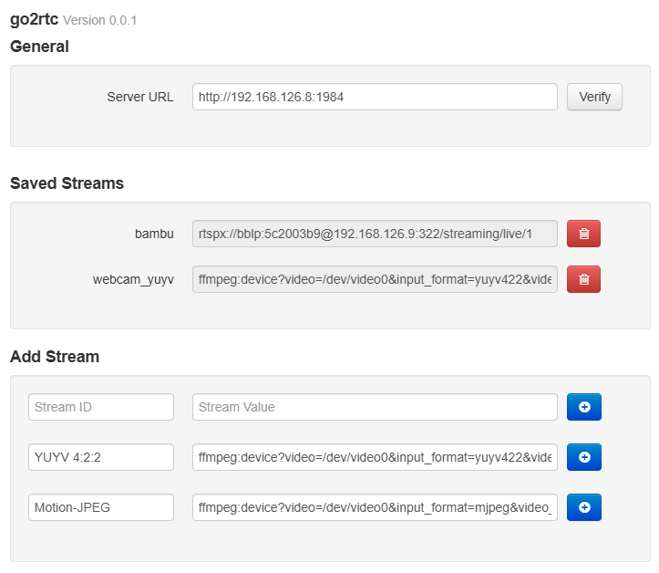
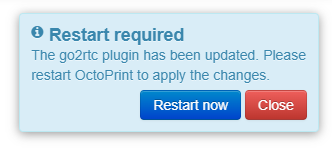

# go2rtc

This plugin allows for the configuration and embedding of [go2rtc](https://github.com/AlexxIT/go2rtc) streams inside OctoPrint's UI directly.

## Requirements

You must have a running go2rtc server/service. There are many [options](https://github.com/AlexxIT/go2rtc#fast-start) available for running go2rtc. For OctoPi 1.0.0+ images I have created [installation steps](https://gist.github.com/jneilliii/93b412cb0bbf6b7bfd76f7e10d612f24?permalink_comment_id=4993013#gistcomment-4993013) to get you started for replacing the default streamers with go2rtc.

## Configuration

Once installed, enter the server address of your go2rtc installation and click verify.

The plugin will validate the server url is reachable and that the necessary configuration settings are set. If a required setting is not detected you will be presented with a warning and direction on changing. The plugin can make this change for you as mentioned in the warning.

Once the required settings are applied, a list of saved streams will display and inputs for adding additional streams. You can either manually enter a stream configuration (see go2rtc's documentation) or click the add button next to one of the ffmpeg detected devices.

Click Save and you will need to restart OctoPrint to get the newly added webcams added to the Control tab properly.

 
 
 ## Get Help

If you experience issues with this plugin or need assistance please use the issue tracker by clicking issues above.

### Additional Plugins

Check out my other plugins [here](https://plugins.octoprint.org/by_author/#jneilliii)

### Sponsors
- Andreas Lindermayr
- [@TheTuxKeeper](https://github.com/thetuxkeeper)
- [@tideline3d](https://github.com/tideline3d/)
- [SimplyPrint](https://simplyprint.io/)
- [Andrew Beeman](https://github.com/Kiendeleo)
- [Calanish](https://github.com/calanish)
- [Lachlan Bell](https://lachy.io/)
- [Jonny Bergdahl](https://github.com/bergdahl)
## Support My Efforts
I, jneilliii, programmed this plugin for fun and do my best effort to support those that have issues with it, please return the favor and leave me a tip or become a Patron if you find this plugin helpful and want me to continue future development.

  

<small>No paypal.me? Send funds via PayPal to jneilliii&#64;gmail&#46;com</small>

